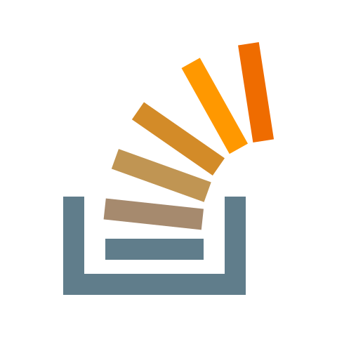

### Hi/Salem! 😄 
  
My name is San, a (lazy) PhD candidate in Biomedical Engineering at Translational Biophotonics Lab, UNIST.  

I love building simple solutions for hard tasks. I seek reasoning behind how and why things actually work. My (humble) experience lies within, but not limited to computer vision, deep learning & mobile platforms for biomedical applications:  
  
:heart: PyTorch  
:dizzy_face: Android  
:grimacing: MATLAB  

⚡ Fun fact: I like tropical house and horse meat :see_no_evil:

You could reach me through the email for any help or suggestions, although I could be late to respond due to my dissertation ㅠㅠ

To stay <i>connected</i>:
  

     

  
<!--

**tuttelikz/tuttelikz** is a ✨ _special_ ✨ repository because its `README.md` (this file) appears on your GitHub profile.

BME Research at TBL

- 🔭 I’m currently working on ...
- 🌱 I’m currently learning ...
- 👯 I’m looking to collaborate on ...
- 🤔 I’m looking for help with ...
- 💬 Ask me about ...
- 📫 How to reach me: ...
- 😄 Pronouns: ...
- ⚡ Fun fact: Eat horse meat
- 🔭 I’m currently working on ...
- 👋
-->
